<!-- <h2 id="motivation">(07/12/2025) Exciting news! GRAM is going to Rio!</h2> -->

  <a href="https://gram-competition.github.io/" style="color: white; text-decoration: underline;">Submit to our competition track!</a> Deadline: April 22, 2026

We are pleased to announce this **second edition of GRaM**, as an **ICLR 2026 workshop**. This year, we will have a focus on **scale and simplicity**. We open three tracks: paper tracks, blogposts track and a new competition track. You can find us on the official [ICLR webpage](https://iclr.cc/virtual/2026/workshop/10000809).

## Speakers

    

        

            <a href="https://kathlenkohn.github.io/">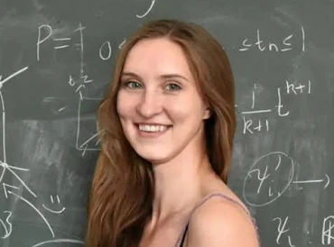</a>
            <strong><a href="https://kathlenkohn.github.io/">Kathlén Kohn</a></strong>
            
KTH

        

    

    

        

            <a href="https://gabloa.github.io/">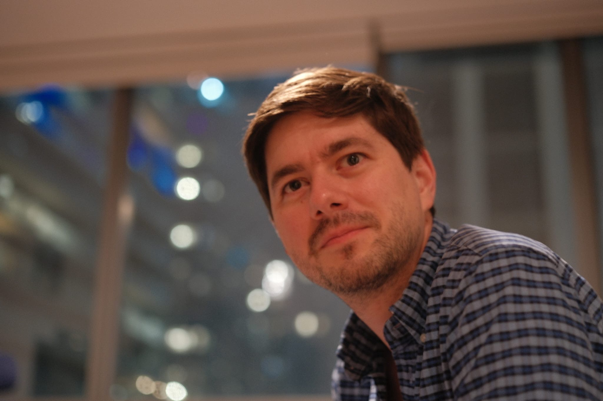</a>
            <strong><a href="https://gabloa.github.io/">Gabriel Loaiza-Ganem</a></strong>
            
Layer 6 AI

        

    

    

        

            
            <strong><a href="https://sites.google.com/view/antheamonod/home">Anthea Monod</a></strong>
            
Imperial College London

        

    

    

        

            <a href="https://sites.google.com/view/mayabechlerspeicer/home">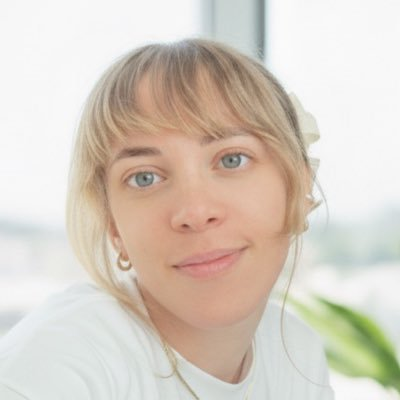</a>
            <strong><a href="https://sites.google.com/view/mayabechlerspeicer/home">Maya Bechler-Speicher</a></strong>
            
Meta

        

    

    

        

            <a href="https://nmboffi.github.io/">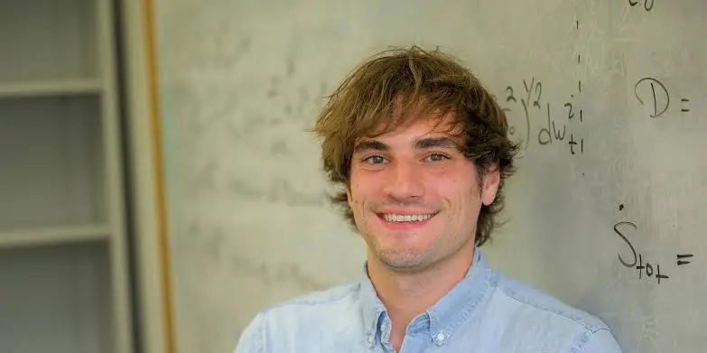</a>
            <strong><a href="https://nmboffi.github.io/">Nicholas Boffi</a></strong>
            
Carnegie Mellon University

        

    

## Panelists

<!-- 
Geometric deep learning promised better generalization through structure, symmetry, and inductive biases. But scale and simplicity now seem to achieve similar results through data and compute alone. Does this make geometry obsolete, or more necessary than ever?
 -->

    

        

            
            <strong><a href="https://kathlenkohn.github.io/">Kathlén Kohn</a></strong>
            
KTH

        

    

    

        

            <a href="https://www.cs.ox.ac.uk/people/michael.bronstein/">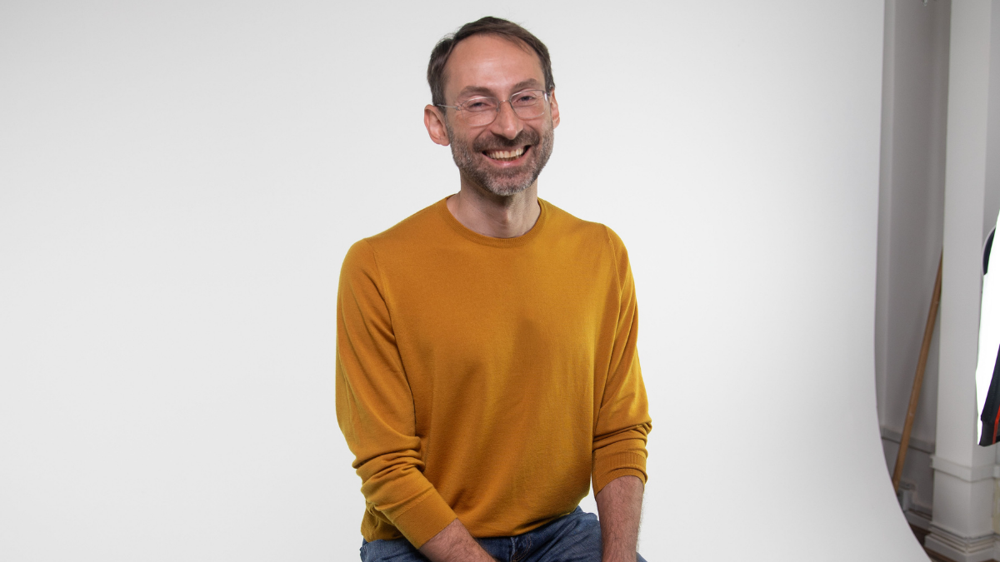</a>
            <strong><a href="https://www.cs.ox.ac.uk/people/michael.bronstein/">Michael Bronstein</a></strong>
            
Oxford and AITHYRA

        

    

    

        

            
            <strong><a href="https://www.linkedin.com/in/max-welling-4a783910/?originalSubdomain=nl">Max Welling</a></strong>
            
CuspAI and UvA

        

    

    

        

            <a href="https://www.alextong.net/">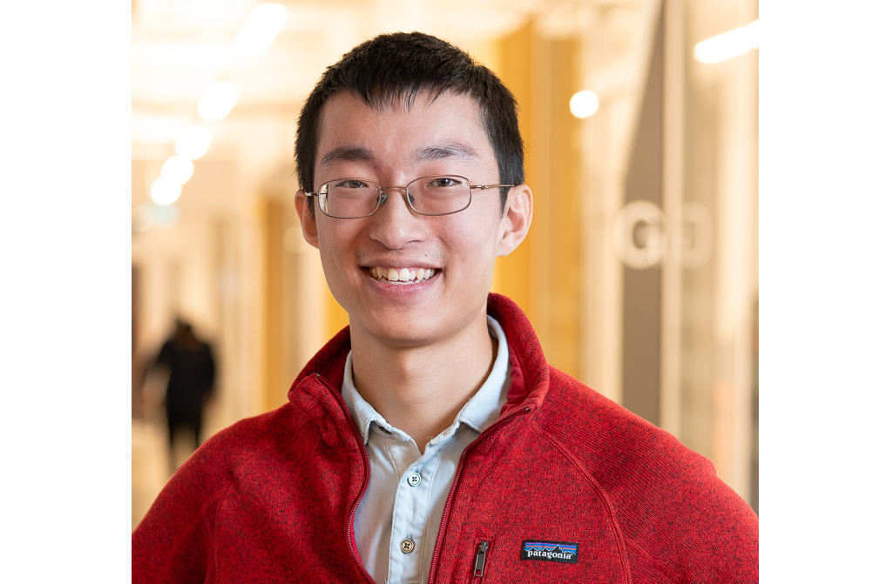</a>
            <strong><a href="https://www.alextong.net/">Alexander Tong</a></strong>
            
AITHYRA

        

    

    

        

            
            <strong><a href="https://gabloa.github.io/">Gabriel Loaiza-Ganem</a></strong>
            
Layer 6 AI

        

    

## Paper heatmap



## Program

Sunday, April 26, 2026 · Room 101 A.

  

    Morning Session
    09:00 – 12:25
  

  

    
09:00 – 09:10

    

      Registration &amp; Welcome
    

  

  

    
09:10 – 09:40

    

      Invited Talk
      

        <a href="https://kathlenkohn.github.io/">Kathlén Kohn</a> —
        "Parameter symmetries, singularities, and group equivariance"
      

    

  

  

    
09:40 – 10:00

    

      Invited Talk
      

        <a href="https://gabloa.github.io/">Gabriel Loaiza-Ganem</a> —
        "A Geometric View of Deep Generative Models"
      

    

  

  

    
10:00 – 10:10

    
Break

  

  

    
10:10 – 11:00

    

      Contributed Talks
      <ul class="program-talks">
        <li>
          <a href="https://iclr.cc/virtual/2026/10019441">The Affine Divergence: Aligning Activation Updates Beyond Normalisation</a> 
          <strong>George Bird</strong>
          10 min
          online
        </li>
        <li>
          <a href="https://iclr.cc/virtual/2026/10019442">Algebraic priors for approximately equivariant networks</a> 
          <strong>Riccardo Ali</strong>, Pietro Liò, Jamie Vicary
          10 min
        </li>
        <li>
          <a href="https://iclr.cc/virtual/2026/10019443">The Geometry of Spectral Gradient Descent: Layerwise Criteria for SignSGD vs SpecSGD</a> 
          <strong>Laura Gomezjurado Gonzalez</strong>, Mahdi Ghaznavi, Hiroki Naganuma, Ioannis Mitliagkas
          5 min
        </li>
        <li>
          <a href="https://iclr.cc/virtual/2026/10019444">mHC-lite: You Don't Need 20 Sinkhorn–Knopp Iterations</a> 
          <strong>Yongyi Yang</strong>, Jianyang Gao
          5 min
          recorded
        </li>
        <li>
          <a href="https://iclr.cc/virtual/2026/10019445">Riemannian Metric Matching for Scalable Geometric Modelling of Distributions</a> 
          <strong>Jacob Bamberger</strong>, Adam Gosztolai, Pierre Vandergheynst, Michael M. Bronstein, Iolo Jones
          5 min
        </li>
      </ul>
      
Followed by a 15-minute Q&amp;A buffer.

    

  

  

    
11:00 – 11:15

    

      <a href="https://beyondmath.com/">BeyondMath: AI for Physics and Engineering</a> &amp; <a href="https://gram-competition.github.io/">Competition Announcements</a>
    

  

  

    
11:15 – 11:35

    

      Invited Talk
      online
      

        <a href="https://sites.google.com/view/antheamonod/home">Anthea Monod</a> —
        "From Geometry to Topology: The Shape of Learning"
      

    

  

  

    
11:35 – 12:25

    

      <a href="https://openreview.net/group?id=ICLR.cc%2F2026%2FWorkshop%2FGRaM#tab-accept-poster">Poster Session A</a>
      
Submissions #0–#73 · <a href="https://openreview.net/group?id=ICLR.cc%2F2026%2FWorkshop%2FGRaM#tab-accept-poster">view posters on OpenReview</a>

    

  

  

    Afternoon Session
    12:25 – 17:00
  

  

    
12:30 – 14:00

    
Lunch

  

  

    
14:00 – 14:40

    

      Panel Discussion
      

         <a href="https://iclr.cc/virtual/2026/10019451">Do scale and simplicity make geometry obsolete, or more necessary than ever?</a> 
         With <a href="https://kathlenkohn.github.io/">Kathlén Kohn</a>,  <a href="https://a1k12.github.io/">Aditi Krishnapriyan</a> (online), <a href="https://www.alextong.net/">Alexander Tong</a>, <a href="https://gabloa.github.io/">Gabriel Loaiza-Ganem</a>, <a href="https://www.linkedin.com/in/max-welling-4a783910/?originalSubdomain=nl">Max Welling</a>, and <a href="https://www.cs.ox.ac.uk/people/michael.bronstein/">Michael Bronstein</a>. 
         Moderated by <a href="https://ebekkers.github.io/">Erik Bekkers</a>.
      

    

  

  

    
14:40 – 14:50

    
Break

  

  

    
14:50 – 15:10

    

      Invited Talk
      

        <a href="https://sites.google.com/view/mayabechlerspeicer/home">Maya Bechler-Speicher</a> —
        "Graph Foundational Models"
      

    

  

  

    
15:15 – 15:45

    

      Invited Talk
      

        <a href="https://nmboffi.github.io/">Nicholas Boffi</a> —
        "Flow Map Language Models"
      

    

  

  

    
15:45 – 15:55

    

      <a href="https://www.newtheory.ai/">New Theory</a>
    

  

  

    
15:55 – 16:05

    

      Closing Remarks
    

  

  

    
16:05 – 16:55

    

      <a href="https://openreview.net/group?id=ICLR.cc%2F2026%2FWorkshop%2FGRaM#tab-accept-poster">Poster Session B</a>
      
Submissions #74–#133 · <a href="https://openreview.net/group?id=ICLR.cc%2F2026%2FWorkshop%2FGRaM#tab-accept-poster">view posters on OpenReview</a>

    

  

  

    
16:55 – 17:00

    

      Wrap Up
    

  

## Deadlines

- **Paper submission:** ~~February 5, 2026 (AoE)~~
- **Paper notification:** ~~March 1st, 2026 (AoE)~~
- **Paper camera-ready:** ~~March 11th, 2026 (AoE)~~
- **Blogpost submission:** ~~April 15, 2026 (AoE)~~
- **Competition submission:** April 22, 2026 (AoE)
- **Workshop dates:** April 26, 2026

## Call for Blogposts <small>(<a href="https://gram-blogposts.github.io/2026/about/">Submit</a>)</small>

We invite submissions to our **blogpost track**. We welcome blog posts in the ICLR Distill format that communicate ideas clearly and accessibly. See the full guidelines and submit on the [blogpost website](https://gram-blogposts.github.io/2026/about/), and explore [blog posts from GRaM 2024](https://gram-blogposts.github.io/2024/) for examples. **Deadline: April 15, 2026 (AoE).**

## Call for Competition <small>(<a href="https://gram-competition.github.io/">Submit</a>)</small>

We are hosting a **benchmark challenge** on transient airflow prediction over 3D geometries inspired by Formula 1 front wings, with simulation data provided by [BeyondMath](https://beyondmath.com/). Given a geometry and airflow at previous time points, predict the airflow at future time points. The winner receives the **MCML Award (500 € prize)**. All valid submissions will be published in the workshop proceedings with co-authorship. Submissions are made via pull requests — see the [competition website](https://gram-competition.github.io/) for details. **Deadline: April 22, 2026 (AoE).**

## Accepted Papers <small>(<a href="https://openreview.net/group?id=ICLR.cc/2026/Workshop/GRaM">OpenReview</a>)</small>

The call for papers is closed. You can see all the accepted papers on the openreview page [ICLR 2026 Workshop GRaM](https://openreview.net/group?id=ICLR.cc/2026/Workshop/GRaM). **Congratulations to all the authors!**

<!-- We welcome submissions to two complementary tracks. Page limits exclude references and appendix:

- **Proceedings track:** Full papers (up to 8 pages) presenting complete research results. Accepted papers will be published in the workshop proceedings at PMLR.

- **Tiny paper track (non-archival):** Short papers (up to 4 pages) intended for early ideas, ongoing work, new perspectives, or contributions that benefit from a lighter review and discussion-oriented format.

Papers should be submitted on the dedicated Openreview submission page [ICLR 2026 Workshop GRaM](https://openreview.net/group?id=ICLR.cc/2026/Workshop/GRaM). Submissions require an OpenReview account (institutional email recommended).

**Template files:** To prepare your submission, please use the following template [download link](assets/GRaM2026_template.zip).
 -->

<!-- ### Important information about the Tiny Papers

Since 2025, ICLR has discontinued the separate "Tiny Papers" track, and is instead requiring each workshop to accept short (3–5 pages in ICLR format, exact page length to be determined by each workshop) paper submissions, with an eye towards inclusion; see [ICLR 2025 Call for Tiny Papers](https://iclr.cc/Conferences/2025/CallForTinyPapers) for a history of the ICLR tiny papers initiative. Authors of these papers will be earmarked for potential funding from ICLR, but need to submit a separate application for Financial Assistance that evaluates their eligibility. This application for Financial Assistance to attend ICLR 2026 will become available on [ICLR 2026](https://iclr.cc/Conferences/2026) at the beginning of February and close early March. -->

## Motivation

Many real-world datasets have geometric structure, but most ML methods ignore such structure, and treat all inputs as plain vectors. **GRaM** is a workshop about **grounding** models in geometry, using ideas from group equivariance to non-Euclidean metrics, to build better, more interpretable representations and generative models.

> An approach is geometrically grounded if it respects the geometric structure of the problem domain and supports geometric reasoning.

For this second edition, we aim to explore the relevance of geometric methods, particularly in the context of large models, focusing on the theme of **scale and simplicity**.

## Topics

We solicit submissions that present theoretical research, methodologies, applications, insightful analysis, and even open problems, within the following topics (list not exhaustive):

- **Preserving data geometry**
  - Preservation of symmetries; e.g., through equivariant operators.
  - Geometric representation systems; e.g., encoding data in intrinsically structured forms via Clifford algebras or steerable vectors with Clebsch-Gordan products.
  - Isometric latent mappings; e.g., learning latent representations of the data via pullback metrics.

- **Inducing geometric structure**
  - Geometric priors; e.g., introducing curvature, symmetry, or topological constraints through explicit regularization.
  - non-Euclidean generative models; e.g., extending diffusion models or flow matching models to non-Euclidean domains with a predefined metric.
  - Metric-preserving embeddings; e.g., learning latent spaces where intrinsic geodesic distances are mapped to Euclidean ones.

- **Geometry in theoretical analysis**
  - Data and latent geometry · Gaining insights on the data manifold, statistical manifold or the latent variables using geometric tools.
  - Loss landscape geometry · Viewing parameters and their optimization trajectory as lying on a manifold, enabling analysis of curvature, critical points, and generalization.
  - Theoretical frameworks · Using differential geometry, algebraic geometry, or group theory to provide a generalizing perspective on generation or representation learning.
  - Open problems · Identifying and addressing unresolved questions and challenges that lie at the intersection of geometry and learning.

- **Scale and Simplicity**
  - Geometry at scale · Does equivariance retain value in large-scale models?
  - Redundancy and minimality · Evaluating when geometric structure is essential versus when simpler architectures suffice.
  - Challenging assumptions · Reporting negative results or limitations of geometric methods to guide future development.

<!-- 
## Call for papers
The workshop solicits submissions to the
- **Proceedings track**: 8 page paper submissions (excluding appendices and references). Submissions will be peer-reviewed. Accepted papers will be published in PMLR as part of our workshop proceedings.
- **Extended abstract track**: 4 page paper submissions (excluding appendices and references). Submissions will be peer-reviewed. Accepted papers can be viewed on openreview.
- **Blogpost track**: blog posts that have tutorial value and act as explainers for (previously) published papers or important topics in the field. In this track, we further encourage blog posts that present opinion pieces, open problems,etc in provided markdown format. Submissions will be peer-reviewed and accepted submissions will be hosted on GRaM wesbite.
- **Tutorial track**: Tutorials with easy-to-use and understand code for topics of important to GRaM audience submitted as a collab file. Submissions will be peer-reviewed and accepted submissions will be hosted on GRaM website.
- **TAG challenge**: We team up with [TAG](https://www.tagds.com/) and host a *ICML Topological Deep Learning Challenge 2024: Beyond the Graph Domain* challenge.

## Reviewing for GRaM
If you would like to review for our workshop, please signup [here](https://docs.google.com/forms/d/e/1FAIpQLSfCEkzvuCyRFTSZQZ97zvohLddXTh8vbd9gzki_C5NRfFH50A/viewform?usp=sf_link).

## Contact
If you have any questions, please feel free to email us at [organizers AT gram-workshop DOT org](mailto:organizers@gram-workshop.org)
-->

## Organizers

<!-- 

  

    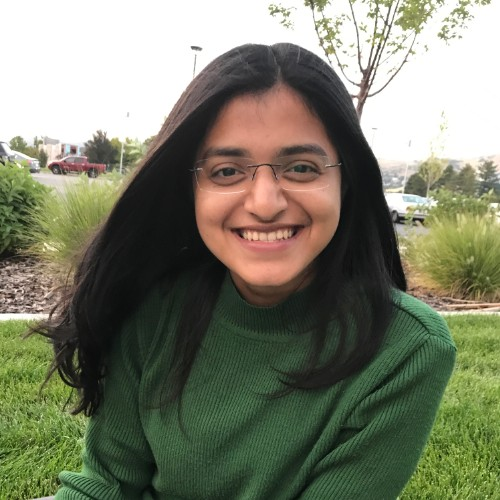
    <strong>Sharvaree Vadgama</strong>

  

    
    <strong>Erik Bekkers</strong>
  

 -->

    

        

            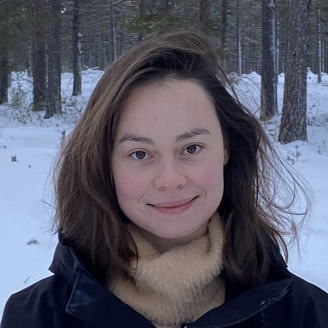
            <strong>Alison Pouplin</strong>
            
Bayer

        

    

    

        

            
            <strong>Sharvaree Vadgama</strong>
            
UC San Diego

        

    

    

        

            
            <strong>Erik Bekkers</strong>
            
Universiteit van Amsterdam

        

    

    

        

            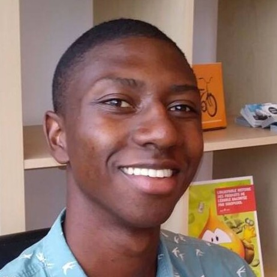
            <strong>Sékou-Oumar Kaba</strong>
            
McGill University and Mila

        

    

    

        

            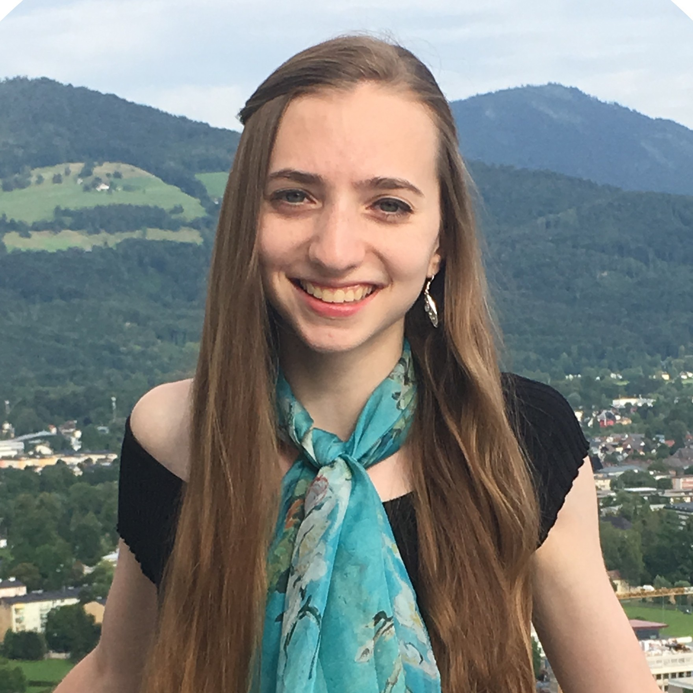
            <strong>Hannah Lawrence</strong>
            
MIT

        

    

    

        

            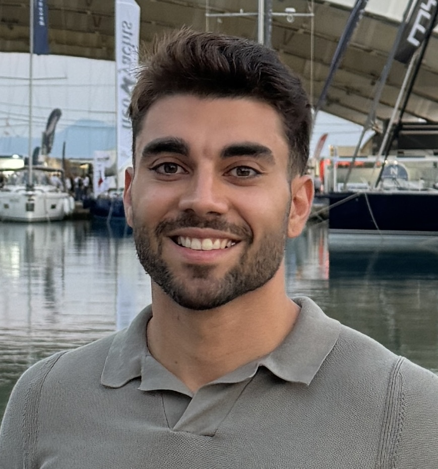
            <strong>Manuel Lecha</strong>
            
IIT and Oxford University

        

    

    

        

            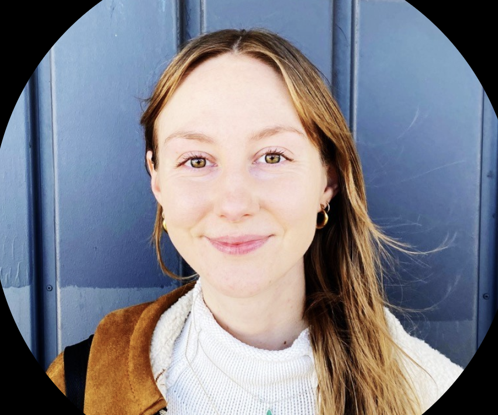
            <strong>Elizabeth (Libby) Baker</strong>
            
DTU Denmark

        

    

    

        

            
            <strong>Julian Suk</strong>
            
TU Munich

        

    

    

        

            
            <strong>Robin Walters</strong>
            
Northeastern University

        

    

    

        

            
            <strong>Jakub Tomczak</strong>
            
Chan Zuckerberg Initiative

        

    

    

        

            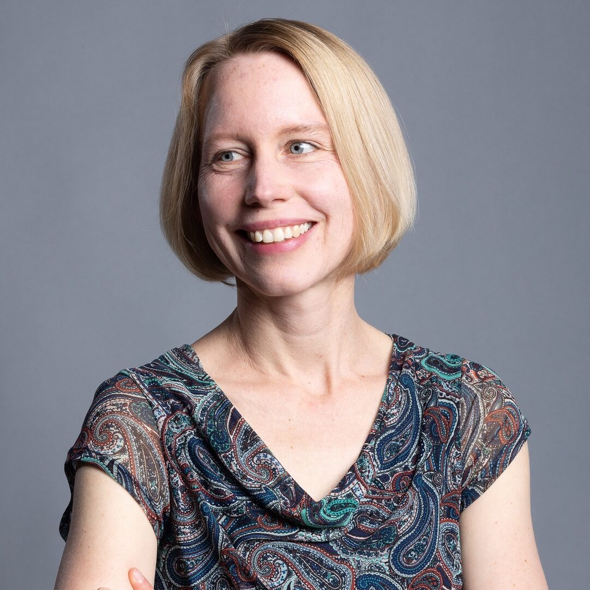
            <strong>Stefanie Jegelka</strong>
            
TU Munich

        

    

    

 <!-- Placeholder to maintain the layout -->
    

 <!-- Placeholder to maintain the layout -->

## Workshop Sponsor

  

## Competition Sponsors

  
  

## Acknowledgements to our co-organzing sponsors

We are grateful to <a href="https://www.newtheory.ai/">New Theory</a> for their generous financial support of the workshop. We also thank <a href="https://beyondmath.com/">BeyondMath</a> for creating and curating the incredible dataset powering our competition, with a special thanks to <strong>Gavin Seegoolam</strong> (BeyondMath) and <strong>Julian Suk</strong> (Competition Area Chair) for making it happen. Finally, we thank <a href="https://mcml.ai/">MCML</a> for providing the competition winners with an award prize.

## Area Chairs

We would like to thank our Area Chairs for their invaluable help with the review process:

- **Elizabeth Baker**, DTU Denmark
- **Erik Bekkers**, Universiteit van Amsterdam
- **Samuel Fadel**, DTU Denmark
- **Sékou-Oumar Kaba**, McGill University and Mila
- **Hannah Lawrence**, MIT
- **Alison Pouplin**, Bayer
- **Behrooz Tahmasebi**, Harvard University
- **Shubhendu Trivedi**, DeepMind
- **Sharvaree Vadgama**, UC San Diego
- **Robin Walters**, Northeastern University
- **Bo Zhao**, UC San Diego

<!-- <footer class="site-footer"> -->
<!-- <a href="https://github.com/ebekkers/website-testing">website-testing</a> is maintained by <a href="https://github.com/ebekkers">ebekkers</a>. -->
<!-- This page was generated by <a href="https://pages.github.com">GitHub Pages</a>. -->
<!-- </footer> -->